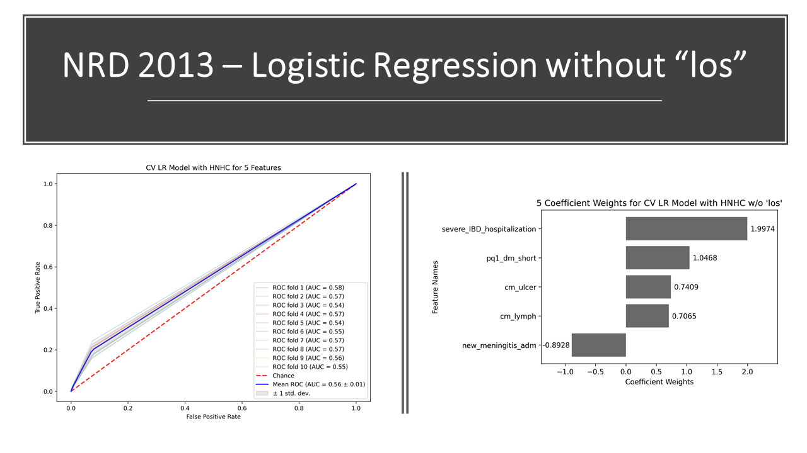
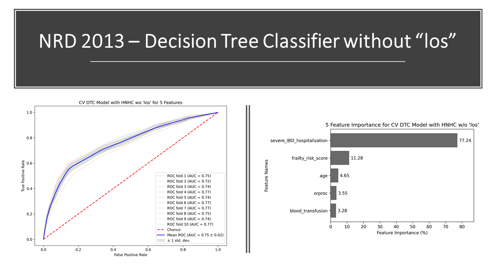
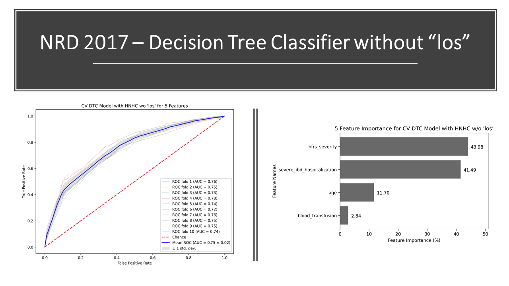
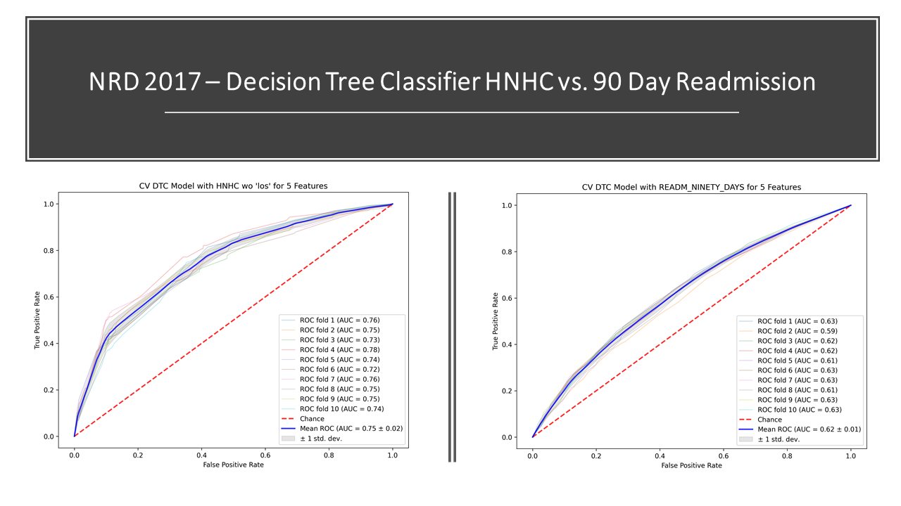

## Background

Inflammatory bowel diseases (IBD) are chronic conditions with a relapsing and remitting course that affects more than 1.6 million people in the United States (US). Patients with IBD require lifelong care, which is associated with significant healthcare costs, with annual healthcare costs estimated to exceed $25.6 billion. While costs for pharmaceuticals are rising, especially with new biologic and small molecule therapies, the number one driver of IBD-related healthcare costs continues to be hospitalizations and emergency room visits, which account for 56% of total health costs in the United States. Current studies estimate ~22-45% of patients with IBD are hospitalized within five years of their diagnosis, with one in five hospitalized patients with IBD readmitted within 30 days of hospital. In patients who have been hospitalized, a subset of high-need, high-cost (HNHC) patients account for a significant proportion of healthcare spending. In previous studies on hospitalizations, hospitalized IBD patients spend a median 6 days in the hospital annually with a subset of HNHC patients spending over 45 days in the hospitally annually with one hospitalized every 2 months and account for 38% of total hospitalization costs. With rising healthcare costs for IBD patients, population health management strategies are needed to inform value-based care for these patients. The first step of population health manamgent is to accurately identify HNHC patients. Current regression-based prediction models to identify hospitalized patients who may progress to HNHC status have poor discrminative performance. Machine learning algorithms may overcome the limitations of regression-based models by accounting for a larger number of potential risk factors and accounting for non-linear relationships. 

## Proposal

The goal of our study is to develop and externally validate novel, simplified, easy-to-understand, point-of-care models built on readily available administrative claims data to accurately identify patients with IBD at risk for becoming high-need, high cost (HNHC).

## Data Sources

Nationwide readmissions databases (NRD) - years 2013 (model development) and 2017 (external validation). NRD is an all-payer database of hospital inpatient stays which longitudinally captures more than 85% of inpatient discharges from more than 20 state inpatient databases. The NRD is part of a family of databases developed for the Healthcare Cost and Utilization Project (HCUP) designed to help researchers and policy makers analyzze national readmissions rates for all pateints. 

## Models

A decision tree is a machine learning model based on binary trees. A decision tree learns the relationship between data in a training set, represented as features(X) and target values(Y), by examining and transforming training data into a binary tree of interior nodes and leaf nodes. 

Each leaf node in the decision tree is responsible for making a specific prediction. For classification trees, the prediction is a target category, such as cancer or not-cancer. A decision tree carves up the feature space into groups of observations that share similar target values and each leaf represents one of these groups. 

Let’s examine a real life decision visualization to understand better using one of the figures from our project.

### Insert picture here. 

At the very top is the root node. It shows there are 35,511 observations in the sample. The decision rule is if the feature orproc less than or equal to 0.5 then we go do the left branch of the tree(True) else we go down the right branch of the tree(False). In the value array we see there are 31,942 samples in the left branch(True) and 3,569 samples in the right branch(False)

The rule is the same as we go down the tree at each node until we arrive at the bottom leaf nodes where we can see the class labels(none or HNHC).

Gini index or Gini impurity measures the degree or probability of a particular variable being wrongly classified when it is randomly chosen. If all the observations belong to a single class, then it can be called pure. The Gini index ranges between 0 and 1, where 0 denotes that all observations belong to a certain class or if there exists only one class, and 1 denotes all the observations are randomly distributed across various classes. A Gini Index of 0.5 denotes equally distributed observations into some classes.

XGboost is a decision-tree based ensemble machine learning model that uses gradient boosting. Ensemble learning is a type of machine learning that uses many models to make predictions together. Boosting algorithms are different  from other ensemble learning techniques by building a sequence of initially weak models into increasingly more powerful models. Gradient boosting algorithms choose how to build a more powerful model using the gradient of a loss function that captures the performance of a model.

## Model development/validation and findings

We used NRD 2013 for the development of our tree-based machine learning algorithms and regression models, while NRD 2017 was used for external validation of our models. A full description of the methodology can be found in our published manuscript. 

Using this cohort and all of the features associated with them, we ran Recursive Feature Elimination (RFE) to identify the top features in three model types. By using RFE and not hand selecting features, we are allowing an algorithm to articulate which features it deems the most important based on the parameters that are given. This also negates any confirmation bias that a researcher may have based on prior knowledge of feature importance as RFE has no outside knowledge of how these features may be related to the target variable. 

The three models consisted of a traditional Logistic Regression (LR) model, a Decision Tree Classifier (DTC) model, and a gradient boosted decision tree model referred to as XGBoost (XGB). Passing in the features from RFE, we came to the conclusion that the tree based models were outperforming the logistic regression model. Established on these findings, we decided to validate our models and feature selections by attempting to replicate our work on the 2017 NRD dataset. There were a few features that were missing or had different definitions when NRD swapped from ICD-9 to ICD-10 codes. ICD is the International Classification of Diseases and Related Health Problems, a globally accepted standard coding practice which is updated from time to time.

One of the selected features was "los", length of stay. This feature could potentially bias the results as the longer a person is in the hospital, the more resources they utilize and the higher the associated costs. To remove any bias from the feature "los", we ran the same algorithms again after removing "los" from the available features. Below are the top 5 features selected by RFE and the cross validated AUC charts for the NRD 2013 (test set) and NRD 2017 (validation set) data sets without "los":

### Logistic Regression:

### Decision Tree Classifier:

### XGBoost:

We also conducted sensitivity analysis using 10 features and obtained similar results between the NRD 2013 and NRD 2017 datasets. Comparing HNHC to a target of 90 day readmission also depicts that HNHC is a better candidate for a target variable as it has significantly better prediction capabilities when looking at the AUC charts. An example of the DTC model below indicates the difference in cross validated AUC between the HNHC and 90 day readmission target outcomes in the NRD 2017 dataset:

There is strong evidence that tree based models such as DTC and XGB are outperforming traditional models like LR. We can conclude that the tree based models are significantly better than traditional models at predicting patients who are at risk of becoming HNHC. Tree-based models also outperformed LR in predicting our secondary outcome of 90-day readmission. 

## Conclusions

Using a nationally representative cohort, we developed simplified tree-based ML models that outperformed traditional LR model in identifying patients with IBD at risk for progression to HNHC and 90-day readmission risk. Population health management strategies using simplified tree-based algorithms on available administrative claims data can accurately identify patients at-risk for becoming HNHC to inform targeted, high-value, low-cost interventions for these patients. 

## Getting Started

See below for required tools in order to run or replicate this project. Users may have to install and set up certain programs/software, links provided where applicable/available.

### Prerequisites and Installation

* [Python](https://www.python.org/) - Working Python coding environment with editor of choice.
* [pandas](https://pandas.pydata.org/) - Data analysis and manipulation tool.
* [NumPy](https://numpy.org/) - Scientific computations including statistics.
* [matplotlib](https://matplotlib.org/) - Visualization tool for Python.
* [scikit-learn](https://scikit-learn.org/stable/) - Machine learning library for Python.
* [Dask](https://dask.org/) - Allows advanced parallelism for analytics.
* [tqdm](https://tqdm.github.io/) - Progress timer for processes.
* [Jupyter Notebook](https://jupyter.org/) - Breaks down workflow processes into steps for validation.
* Please install any additional Python dependencies, as needed, depending on your coding environment.

## Steps to Run Code

1. Install and set up all of the prerequisites per the instructions provided by the developers.
2. Create a clone of the repository to your local system.
3. [continue once we know what files will be available on the repo]

## Built With

* [Python](https://www.python.org/) - Working Python coding environment with editor of choice.
* [pandas](https://pandas.pydata.org/) - Data analysis and manipulation tool.
* [NumPy](https://numpy.org/) - Scientific computations including statistics.
* [matplotlib](https://matplotlib.org/) - Visualization tool for Python.
* [scikit-learn](https://scikit-learn.org/stable/) - Machine learning library for Python.
* [Dask](https://dask.org/) - Allows advanced parallelism for analytics.
* [tqdm](https://tqdm.github.io/) - Progress timer for processes.
* [Jupyter Notebook](https://jupyter.org/) - Breaks down workflow processes into steps for validation.
* [Visual Studio Code](https://code.visualstudio.com/) - Open source code editor.

## Contributors

* [Nghia Nguyen](https://github.com/nghia-h-nguyen) - https://www.linkedin.com/in/nghia-nguyen-7794578/
* [Alexander Qian](https://github.com/alexsqian) - 
* [Peter Chen](https://github.com/datailluminations) - https://www.linkedin.com/in/peterljchen/
* [Sagar Patel](https://github.com/Autonomousse) - 

## Acknowledgments

* [HCUP](https://www.hcup-us.ahrq.gov/) - Largest collection of longitudinal hospital care data in the United States.
* [ICD10Data.com](https://www.icd10data.com/) - Medical coding reference.

## Publications and Recognition

Link to our full publication: ### insert publication link here
